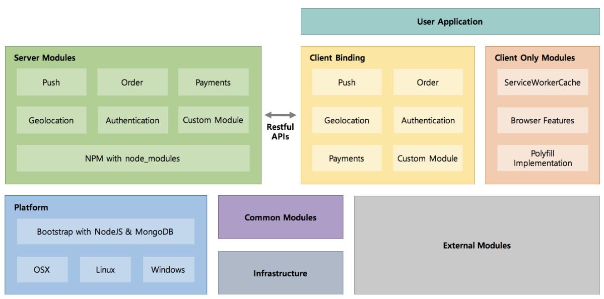
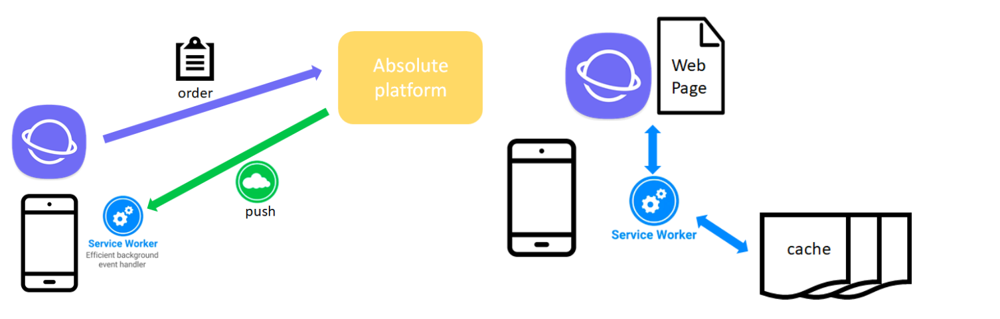

# Absolute - Web based O2O service platform

Absolute is a web-based order platform like siren-order for Starbucks.
We are focused on creating the platform that is portable, cheaper, easier,
decentralized and appless.

- Easier
  - No 'App' install but you can use service. You don't need create account and login any more

- Cheaper
  - Absloute is cheaper than other platforms. Because you can just use it if you want.

- Portable:
  - Absloute support multiple os platform. So, The services you have developed can be used by multiple operating systems.

### Architecture

### Major Features
- [Web Client -Service-worker](./client/service-worker.md)
- [Server - Push & oder](./server/server.md) 
- [Server - Payment](./payment.md)

### Control Flow

## Getting Started

### Contributing to Absolute
Contributions to Absolute are welcomed and encouraged! Please see the
[Contributing to Absolute guide](./contribution/contribution.md)

### Building Absolute
./absolut start

### Testing Absolute

## License

This project is released under an Apache 2.0 open source license. Please see [LICENSE.md](https://github.com/lunchclass/absolute/blob/master/LICENSE.md)
